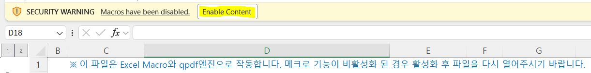
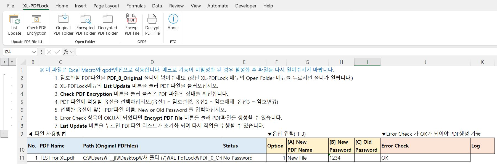

# XL-PDFLock - 엑셀 PDF 자동 암호화

> 🎯 **XL-DailyPayroll V.1.0**  
> Excel 기반의 PDF 일괄 암호 관리 도구입니다.
> 파일별 암호 상태를 확인하고, 지정한 옵션에 따라 암호 설정·해제·변경을 자동 처리합니다.
>  
> 🔧 주요 기능
>- **파일 목록 조회** — 지정 폴더의 PDF 파일 목록 자동 불러오기
>- **암호 상태 확인** — 파일별 `Locked` / `Unlocked` 상태 표시
>- **일괄 처리** — 파일별 암호 설정·해제·변경 및 출력 파일명 지정
>- **오류 확인** — 처리 중 발생한 오류 감지 및 로그 표시

※ 이 도구는 [qpdf](https://github.com/qpdf/qpdf) 엔진을 기반으로 작동하며, Excel에서 `qpdf.exe`를 호출해 PDF 암호화·해제·재암호화를 수행합니다.

***
## 파일 다운로드
[XL-PDFLock_V0.1.zip 다운로드](https://github.com/hauovv/AutoHR/raw/refs/heads/main/XL-PDFLock/Files/XL-PdfLock_V1.0.zip)
※ zip 압축 파일입니다. 반드시 압축을 풀고 사용하세요.

## 파일 사용법
 

